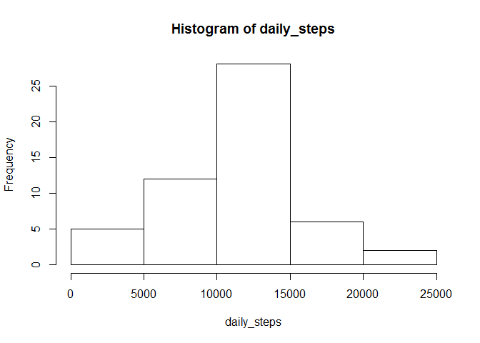

# Reproducible Research: Peer Assessment 1


## Loading and preprocessing the data

```r
#reading csv files
activity <- read.csv("activity.csv")

#processing data
library(reshape2)
activity_melt <- melt(activity, id = c("date", "interval"))
activity_data <- dcast(activity_melt, interval ~ date)
```

## What is mean total number of steps taken per day?


```r
daily_steps <- colSums(activity_data[,2:62])
hist(daily_steps)
```

 

```r
mean.daily.steps <- mean(daily_steps, na.rm = TRUE)
median.daily.steps <- median(daily_steps, na.rm = TRUE)
```

The mean daily steps are 1.0766189\times 10^{4}.  
The median daily steps are 1.0765\times 10^{4}.  


## What is the average daily activity pattern?


```r
activity_data$intervalmeans <- rowMeans(activity_data[,2:62], na.rm = TRUE)
plot(activity_data$intervalmeans, type = "l", xlab = "Interval Index", ylab = "Average Number of Steps")
```

 

```r
activity_data$maxactivity <- activity_data$intervalmeans == 
    max(activity_data$intervalmeans, na.rm= TRUE)

#interval with max activity
max_interval <- activity_data[activity_data$maxactivity == 1,]$interval
```
The interval with the maximum activity is 835 interval.  

## Imputing missing values

```r
#Number of missing values - 2304
missingvals <- sum(is.na(activity_data[-c(1,63,64)]))
```
Number of missing values 2304.  

I have included means of the specific 5 minute intervals where NAs are present.  

```r
#imputing missing values - using rowmeans
for(i in 1:nrow(activity_data)){
    activity_data[i, is.na(activity_data[i,])] <- 
        round(activity_data$intervalmeans[i],0)
}


# After removing NA -  Mean Total number of steps per day
daily_steps_new <- colSums(activity_data[,2:62])
hist(daily_steps_new)
```

 

```r
new.mean.dailysteps <- mean(daily_steps_new)
new.median.dailysteps <- median(daily_steps_new)
```
The new mean daily steps are 1.0765639\times 10^{4}.  
The new median daily steps are 1.0762\times 10^{4}.  

```r
#impact of imputations
change.mean <- round(mean.daily.steps - new.mean.dailysteps, digits = 2)
change.median <- median.daily.steps - new.median.dailysteps
```
The change in mean daily steps is 0.55.  
The change in mean daily steps is 3.      

## Are there differences in activity patterns between weekdays and weekends?

```r
#removing unneeded rows
activity_data <- activity_data[-c(289:290),]

#transposing dataframe
activity_data_transpose <- as.data.frame(t(activity_data))

#Getting date and time values in
activity_data_transpose$newdates <- rep(NA,64)
datetime <- rownames(activity_data_transpose)
datetime[c(1,63,64)] <- ""
activity_data_transpose$newdates <- as.Date(datetime,"%Y-%m-%d")

#to find out if day is a weekday or weekend
library("timeDate")
activity_data_transpose$daytest <- NA
for(i in 2:62){
    if(isWeekday(activity_data_transpose$newdates[i])) activity_data_transpose$daytest[i] <- "Weekday"
    if(isWeekend(activity_data_transpose$newdates[i])) activity_data_transpose$daytest[i] <- "Weekend"
}
activity_data_transpose$daytest <- as.factor(activity_data_transpose$daytest)

#processing data for plotting
names(activity_data_transpose)[1:288] <- activity_data[,1]
activity_data_transpose <- activity_data_transpose[,c(1:288,290)]
activity_transpose_melt <- melt(activity_data_transpose, id = c("daytest"), na.rm = TRUE)
names(activity_transpose_melt) = c("daytest", "interval", "value")

## where activity melt has NA's in daytest column - remove
data_melt.sub <- subset(activity_transpose_melt, daytest != "")

#converting character values to numeric
data_melt.sub$value <- as.numeric(data_melt.sub$value)


# Actual Plotting
library("lattice")
xyplot(value~interval | daytest, data = data_melt.sub, type = "l",
       layout=c(1,2),xlab="Interval",ylab = "Number of steps")
```

 

```r
# Average data on weekdays and weekends for every interval
plotsteps <- dcast(data_melt.sub, interval ~ daytest, mean)
```
Some details from the summarized values:  

```r
head(plotsteps)
```

```
##   interval    Weekday Weekend
## 1        0 2.28888889    0.25
## 2        5 0.40000000    0.00
## 3       10 0.15555556    0.00
## 4       15 0.17777778    0.00
## 5       20 0.08888889    0.00
## 6       25 1.57777778    3.50
```
